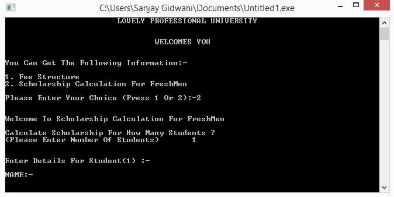

# Scholarship Calculator

In this project, a student should be able to enter marks of 12th Standard, JEE Mains, LPUNEST and if the student has received any medal in National Games should be able to enter details about it on a CLI and based on the "University's Scholarship Policy 2016" the scholarship information of the student should be stored in a file.

I used C++ programming language with basic OOPs (Object Oriented Programming) and File Handling concepts to create this project.

